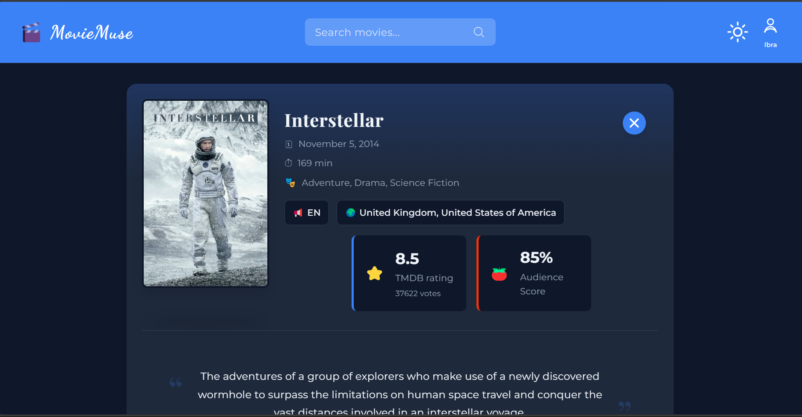
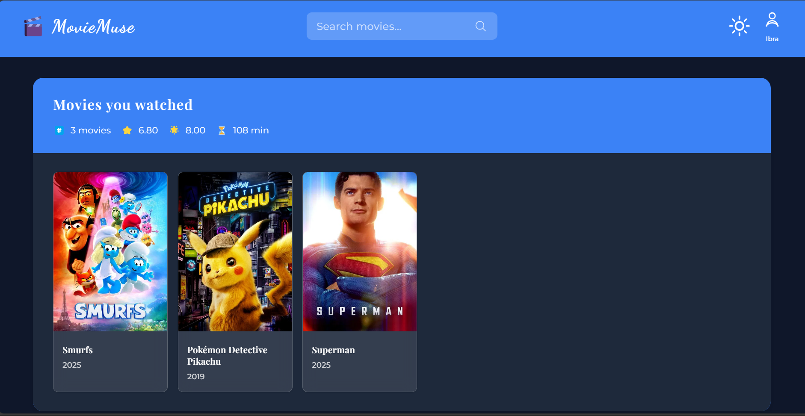

# MovieMuse 🎬

MovieMuse is a full-stack application that allows users to search for movies, view detailed information, rate them, and create a personalized watchlist. The application features a modern, responsive design with user authentication and a persistent database to store user data.

## Features

- **User Authentication**: Secure user registration and login system using JWT and bcrypt.
- **Personalized Watchlist**: Each user has their own watchlist stored in a MongoDB database.
- **Powerful Movie Search**: Find movies using the TMDB API with instant results.
- **Comprehensive Movie Details**: View detailed information including plot, cast, director, ratings, and more.
- **Personal Rating System**: Rate movies on a scale of 1-10 and add your own reviews.
- **Smart Recommendations**: Get personalized movie recommendations based on your watchlist.
- **Bookmarking System**: Keep track of movies you've watched with your ratings and reviews.
- **Similar Movies**: Discover related movies based on your current selection.
- **Dark/Light Theme**: Toggle between light and dark themes based on your preference.
- **Responsive Design**: Enjoy a seamless experience across desktop, tablet, and mobile devices.

## Screenshots

### Main Interface with Movie Search


_The main interface showing search functionality and movie results with a clean, modern design_

### Movie Details View


_Detailed movie view displaying comprehensive information, ratings, and similar movie recommendations_

### Watchlist with User Ratings


_Personal watchlist showing rated and reviewed movies with summary statistics_

## Technologies Used

### Frontend

- **React**: Front-end UI library using functional components and hooks.
- **Custom Hooks**: Created specialized hooks for local storage, API fetching, and keyboard events.
- **TMDB API**: Primary API for movie data, search, recommendations and similar movies.
- **CSS3**: Modern styling with custom properties for theming.
- **Responsive Design**: Flexbox and CSS Grid for layout across all device sizes.
- **ES6+ JavaScript**: Modern JavaScript features and syntax.

### Backend

- **Node.js**: JavaScript runtime for the server.
- **Express**: Web framework for Node.js.
- **MongoDB**: NoSQL database for storing user data.
- **Mongoose**: Object Data Modeling (ODM) library for MongoDB.
- **JWT (JSON Web Tokens)**: For secure user authentication.
- **bcryptjs**: For hashing user passwords.

## Project Structure

```
moviemuse/
├── backend/
│   ├── middleware/
│   ├── models/
│   ├── routes/
│   ├── server.js
│   └── package.json
├── public/
│   ├── index.html
│   └── favicon.ico
├── src/
│   ├── components/
│   ├── hooks/
│   ├── utils/
│   ├── App.jsx
│   ├── index.js
│   └── index.css
└── screenshots/
```

## Setup and Installation

### Prerequisites

- Node.js and npm
- MongoDB

### Backend Setup

1. Navigate to the `backend` directory:
   ```
   cd backend
   ```
2. Install dependencies:
   ```
   npm install
   ```
3. Create a `.env` file in the `backend` directory and add the following variables:
   ```
   MONGO_URI=your_mongodb_connection_string
   JWT_SECRET=your_jwt_secret
   ```
4. Start the backend server:
   ```
   npm start
   ```

### Frontend Setup

1. Navigate to the root project directory:
   ```
   cd ..
   ```
2. Install dependencies:
   ```
   npm install
   ```
3. Create a `.env` file in the root directory and add your API keys:
   ```
   REACT_APP_TMDB_API_KEY=your_tmdb_api_key_here
   REACT_APP_TMDB_BASE_URL=https://api.themoviedb.org/3
   REACT_APP_TMDB_IMAGE_URL=https://image.tmdb.org/t/p/w500
   ```
4. Start the frontend development server:
   ```
   npm start
   ```
5. Open your browser and navigate to `http://localhost:3000`

## API Endpoints

### Auth

- `POST /api/auth/signup`: Register a new user.
- `POST /api/auth/login`: Authenticate user and get token.

### Watchlist

- `GET /api/watchlist`: Get the logged-in user's watchlist.
- `POST /api/watchlist/add`: Add or update a movie in the watchlist.
- `DELETE /api/watchlist/remove/:imdbID`: Remove a movie from the watchlist.
